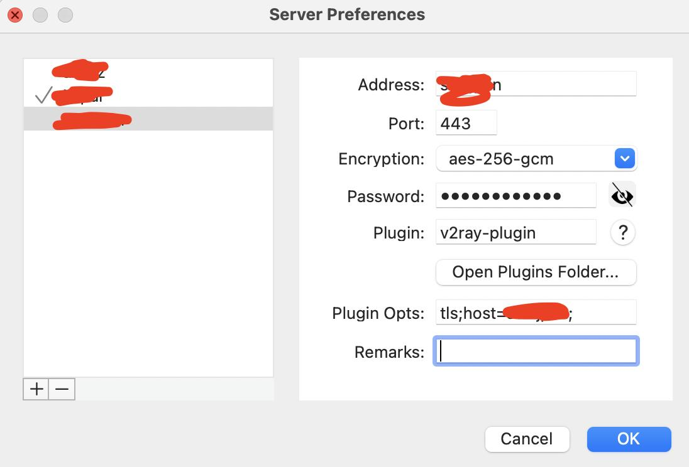

# Shadowsocks with v2ray-plugin for Doprax

在`Doprax`搭建`Shadowsocks`服务，使用`Cloudflare Tunnel`穿透访问。

服务端使用[v2ray-plugin](https://github.com/shadowsocks/v2ray-plugin)插件伪装成`http`流量穿透网关，客户端使用安装了对应插件的客户端进行连接服。

详细说明 [Shadowsocks-with-v2ray-plugin-for-Doprax]https://www.xjp.in/2023/03/25/Shadowsocks-with-v2ray-plugin-for-Doprax/

# 服务端部署

0. 登录[Cloudflare](https://dash.cloudflare.com/)添加域名
1. 创建`Cloudflare Tunnel`，绑定域名与服务端口，默认端口为 `8388`
1. 登录[doprax](https://www.doprax.com/)创建应用后，关联`github`将[本项目](https://github.com/thesadabc/Shadowsocks-with-v2ray-plugin-for-Doprax)导入
2. 配置环境变量，启动容器


另有不依赖`Cloudflare`直连`Doprax`的镜像，[plugin_v2ray_no_tunnel.dockerfile](./other/plugin_v2ray_no_tunnel.dockerfile)

更多详细说明 [Shadowsocks-with-v2ray-plugin-for-Doprax]https://www.xjp.in/2023/03/25/Shadowsocks-with-v2ray-plugin-for-Doprax/

# 客户端使用

### `shadowsocks`客户端

相关配置:



客户端[`ShadowsocksX-NG`](https://github.com/shadowsocks/ShadowsocksX-NG)内置`v2ray-plugin`插件

[`shadowsocks-windows`](https://github.com/shadowsocks/shadowsocks-windows)，需下载[`v2ray-plugin`插件](https://github.com/shadowsocks/v2ray-plugin)后放志与客户端同一个文件夹，重命名为`v2ray-plugin.exe`。

### v2ray客户端

支持[v2ray客户端](https://www.v2ray.com/)例如[V2rayU](https://github.com/yanue/V2rayU)连接

v2ray客户端对应配置文件：

参考自[v2ray-plugin/issues/49](https://github.com/shadowsocks/v2ray-plugin/issues/49)

```js
{
    "inbounds": [{
        "port": 1081,
        "listen": "127.0.0.1",
        "protocol": "socks"
    }],
    "outbounds": [{
        "tag": "protocol_layer",
        "protocol": "shadowsocks",
        "settings":{
            "servers": [{
                "address": "ss.example.com",
                "port": 443,
                "method": "aes-256-gcm",
                "password": "password"
            }]
        },
        "proxySettings": {
            "tag": "transport_layer"
        }
    },
    {
        "tag": "transport_layer",
        "protocol": "freedom",
        "settings": {
            "redirect": "ss.example.com:443"
        },
        "streamSettings": {
            "network": "ws",
            "security": "tls"
        },
        "mux": {
            "enabled": true
        }
    }]
}
```

### Docker

[v2fly-core](https://github.com/v2fly/v2ray-core)镜像

```bash
docker run --rm -p1081:1081 -v `pwd`/v2ray_client_for_ss.json:/etc/v2fly/config.json v2fly/v2fly-core run -c /etc/v2fly/config.json 
```

[shadowsocks-libev](https://github.com/shadowsocks/shadowsocks-libev)镜像

```bash
docker run --rm -p1081:1081 -v/path/to/v2ray-plugin:/usr/bin/v2ray-plugin shadowsocks/shadowsocks-libev ss-local -sss.example.com -p443 -b0.0.0.0 -l1081 '-kpassword' -maes-256-gcm --plugin v2ray-plugin --plugin-opts "tls;host=ss.example.com;"

```
